# CodeSentinel Database Architecture & Schema Design

**Document Version:** 1.0.0  
**Status:** Approved / Proposed  
**Author:** Senior Software Architect  
**Target Engine:** PostgreSQL 15+  
**ORM & Migration Tooling:** SQLAlchemy 2.0 + Alembic  

---

## 1. Executive Summary & Database Overview

The CodeSentinel database architecture is designed to serve as a secure, high-performance, multi-tenant relational foundation for an automated AI code review platform. The database schema stores user identities, organization memberships, GitHub App integration metadata, pull request tracking records, asynchronous review job executions, structured review findings, AI model token usage metrics, and audit event logs.

### Key Architectural Principles:
1. **Engine**: PostgreSQL 15+ utilizing native JSONB, `TIMESTAMPTZ`, and UUID generation extensions (`uuid-ossp` or `gen_random_uuid()`).
2. **Primary Key Standard**: All application-owned entities use 128-bit Universally Unique Identifiers (`UUIDv4`) generated as primary keys (`id UUID DEFAULT gen_random_uuid() PRIMARY KEY`). External IDs from GitHub (e.g., GitHub User ID, GitHub Installation ID, GitHub Repository ID, GitHub Pull Request ID) are indexed as explicit numeric/bigint columns for integration lookups but never serve as application primary keys.
3. **Multi-Tenant Data Isolation**: Every organization-owned entity explicitly stores `organization_id UUID NOT NULL` to simplify row-level access control (RLS), eliminate deep JOIN performance overhead during authorization checks, and prevent cross-tenant data leaks.
4. **Strict Schema Constraints**: Foreign key integrity, check constraints, explicit uniqueness constraints, and non-nullable defaults enforce data hygiene at the engine level.
5. **No Password Storage**: Authentication is delegated to GitHub OAuth / SSO. No passwords or authentication credentials are stored in plaintext.

---

## 2. Multi-Tenancy & Authorization Strategy

CodeSentinel uses a **Logical Multi-Tenancy** architecture with shared database instances and schema-level tenant isolation.

### 2.1 Organization Tenant Isolation
- `organizations` represents the top-level tenant container.
- Resources belonging to an organization (`repositories`, `pull_requests`, `reviews`, `review_findings`, `ai_usage`, `audit_logs`) explicitly include an `organization_id` foreign key column.
- **Direct vs. Derived Tenant Foreign Keys**: While `organization_id` could theoretically be derived by joining through `reviews -> pull_requests -> repositories -> organizations`, storing `organization_id` directly on child tables (`reviews`, `review_findings`, `review_jobs`, `ai_usage`) provides three critical advantages:
  1. **Security**: Allows stateless API middleware and Row Level Security (RLS) policies to validate tenant boundaries directly (`WHERE organization_id = :user_org_id`) without multi-table JOIN traversal.
  2. **Query Simplicity & Performance**: Eliminates costly 4-way JOINs when retrieving review findings or calculating monthly organization AI token usage.
  3. **Auditability**: Ensures that even if parent relationships change (e.g., repository transferred or archived), historical review logs and AI billing usage remain immutably anchored to the correct tenant.

---

## 3. Entity ER Diagram (Mermaid)

```mermaid
erDiagram
    users ||--o{ organization_members : "belongs to"
    organizations ||--o{ organization_members : "has"
    organizations ||--o{ github_installations : "installs"
    organizations ||--o{ repositories : "owns"
    github_installations ||--o{ repositories : "manages"
    repositories ||--o{ pull_requests : "contains"
    pull_requests ||--o{ pull_request_files : "modifies"
    pull_requests ||--o{ review_jobs : "triggers"
    pull_requests ||--o{ reviews : "has"
    review_jobs ||--o| reviews : "produces"
    reviews ||--o{ review_findings : "contains"
    reviews ||--o{ review_comments : "generates"
    reviews ||--o{ ai_usage : "consumes"
    organizations ||--o{ ai_usage : "billed for"
    organizations ||--o{ audit_logs : "records"
    users ||--o{ audit_logs : "performs"

    users {
        uuid id PK
        bigint github_user_id UK
        string email
        string display_name
        string avatar_url
        boolean is_active
        timestamptz created_at
        timestamptz updated_at
    }

    organizations {
        uuid id PK
        string name
        string slug UK
        string avatar_url
        boolean is_active
        timestamptz created_at
        timestamptz updated_at
    }

    organization_members {
        uuid id PK
        uuid organization_id FK
        uuid user_id FK
        string role
        timestamptz created_at
        timestamptz updated_at
    }

    github_installations {
        uuid id PK
        uuid organization_id FK
        bigint github_installation_id UK
        string target_type
        string target_name
        string status
        text encrypted_installation_token
        timestamptz token_expires_at
        timestamptz created_at
        timestamptz updated_at
    }

    repositories {
        uuid id PK
        uuid organization_id FK
        uuid github_installation_id FK
        bigint github_repo_id UK
        string name
        string full_name UK
        string owner_handle
        string default_branch
        boolean is_private
        boolean is_archived
        boolean is_active
        timestamptz created_at
        timestamptz updated_at
    }

    pull_requests {
        uuid id PK
        uuid repository_id FK
        uuid organization_id FK
        bigint github_pr_id UK
        integer number
        string title
        text description
        string author_handle
        string source_branch
        string target_branch
        string head_sha
        string base_sha
        string state
        boolean is_merged
        timestamptz merged_at
        timestamptz created_at
        timestamptz updated_at
    }

    pull_request_files {
        uuid id PK
        uuid pull_request_id FK
        string file_path
        string status
        integer additions
        integer deletions
        integer changed_lines
        string blob_sha
        timestamptz created_at
    }

    review_jobs {
        uuid id PK
        uuid pull_request_id FK
        uuid organization_id FK
        string commit_sha
        string status
        integer retry_count
        text error_message
        string idempotency_key UK
        timestamptz started_at
        timestamptz completed_at
        timestamptz created_at
        timestamptz updated_at
    }

    reviews {
        uuid id PK
        uuid pull_request_id FK
        uuid review_job_id FK
        uuid organization_id FK
        string commit_sha
        string status
        text summary
        string overall_risk
        integer total_findings
        integer critical_count
        integer high_count
        integer medium_count
        integer low_count
        integer info_count
        string analyzer_version
        string ai_model
        timestamptz started_at
        timestamptz completed_at
        timestamptz created_at
        timestamptz updated_at
    }

    review_findings {
        uuid id PK
        uuid review_id FK
        uuid organization_id FK
        string fingerprint
        string severity
        string category
        string title
        text description
        text impact
        string file_path
        integer line_number
        text evidence
        text suggested_fix
        string confidence
        string source
        string status
        string dismiss_reason
        timestamptz created_at
        timestamptz updated_at
    }

    review_comments {
        uuid id PK
        uuid review_id FK
        uuid finding_id FK
        bigint github_comment_id
        string file_path
        integer line_number
        text body
        string status
        text error_message
        timestamptz posted_at
        timestamptz created_at
        timestamptz updated_at
    }

    ai_usage {
        uuid id PK
        uuid organization_id FK
        uuid review_id FK
        uuid user_id FK
        string provider
        string model
        integer request_count
        integer input_tokens
        integer output_tokens
        numeric estimated_cost_usd
        timestamptz created_at
    }

    audit_logs {
        uuid id PK
        uuid organization_id FK
        uuid actor_id FK
        string action
        string resource_type
        string resource_id
        jsonb metadata
        string ip_address
        timestamptz created_at
    }
```

---

## 4. Entity Schema Specifications

### 4.1 `users`
Stores user profile and authentication information for local and GitHub OAuth users.

- **Primary Key**: `id UUID DEFAULT gen_random_uuid()`
- **Columns**:
  - `id`: `UUID` | `NOT NULL` | `PRIMARY KEY`
  - `name`: `VARCHAR(255)` | `NULLABLE`
  - `email`: `VARCHAR(255)` | `NOT NULL` | `UNIQUE`
  - `hashed_password`: `VARCHAR(255)` | `NULLABLE` (Hashed password for local email/password authentication)
  - `role`: `VARCHAR(50)` | `NOT NULL` | `DEFAULT 'developer'` (Role e.g. `admin`, `developer`, `user`)
  - `github_user_id`: `BIGINT` | `NULLABLE` | `UNIQUE` (GitHub user numeric ID)
  - `github_handle`: `VARCHAR(255)` | `NULLABLE` (GitHub username/login)
  - `display_name`: `VARCHAR(255)` | `NULLABLE`
  - `avatar_url`: `TEXT` | `NULLABLE`
  - `is_active`: `BOOLEAN` | `NOT NULL` | `DEFAULT true`
  - `created_at`: `TIMESTAMPTZ` | `NOT NULL` | `DEFAULT NOW()`
  - `updated_at`: `TIMESTAMPTZ` | `NOT NULL` | `DEFAULT NOW()`
- **Indexes**:
  - `idx_users_github_user_id` (`github_user_id`) UNIQUE
  - `idx_users_email` (`email`) UNIQUE
  - `idx_users_role` (`role`)
- **Security Rule**: Tokens (GitHub OAuth access tokens) are stored encrypted in worker sessions or separate transient Redis tokens, **never** in plain text in `users`.

---

### 4.2 `organizations`
Represents customer tenants (teams, companies, or individual accounts).

- **Primary Key**: `id UUID DEFAULT gen_random_uuid()`
- **Columns**:
  - `id`: `UUID` | `NOT NULL` | `PRIMARY KEY`
  - `name`: `VARCHAR(255)` | `NOT NULL`
  - `slug`: `VARCHAR(255)` | `NOT NULL` | `UNIQUE` (URL-friendly organization identifier)
  - `avatar_url`: `TEXT` | `NULLABLE`
  - `is_active`: `BOOLEAN` | `NOT NULL` | `DEFAULT true`
  - `created_at`: `TIMESTAMPTZ` | `NOT NULL` | `DEFAULT NOW()`
  - `updated_at`: `TIMESTAMPTZ` | `NOT NULL` | `DEFAULT NOW()`
- **Indexes**:
  - `idx_organizations_slug` (`slug`) UNIQUE

---

### 4.3 `organization_members`
Maps users to organizations with defined role-based access control (RBAC).

- **Primary Key**: `id UUID DEFAULT gen_random_uuid()`
- **Columns**:
  - `id`: `UUID` | `NOT NULL` | `PRIMARY KEY`
  - `organization_id`: `UUID` | `NOT NULL` | `FK -> organizations(id) ON DELETE CASCADE`
  - `user_id`: `UUID` | `NOT NULL` | `FK -> users(id) ON DELETE CASCADE`
  - `role`: `VARCHAR(50)` | `NOT NULL` | `CHECK (role IN ('owner', 'admin', 'member'))`
  - `created_at`: `TIMESTAMPTZ` | `NOT NULL` | `DEFAULT NOW()`
  - `updated_at`: `TIMESTAMPTZ` | `NOT NULL` | `DEFAULT NOW()`
- **Constraints & Indexes**:
  - `uk_org_members_org_user` (`organization_id`, `user_id`) UNIQUE
  - `idx_org_members_user_id` (`user_id`)

---

### 4.4 `github_installations`
Stores metadata for the installed CodeSentinel GitHub App on a user or organization account.

- **Primary Key**: `id UUID DEFAULT gen_random_uuid()`
- **Columns**:
  - `id`: `UUID` | `NOT NULL` | `PRIMARY KEY`
  - `organization_id`: `UUID` | `NOT NULL` | `FK -> organizations(id) ON DELETE CASCADE`
  - `github_installation_id`: `BIGINT` | `NOT NULL` | `UNIQUE` (GitHub App Installation ID)
  - `target_type`: `VARCHAR(50)` | `NOT NULL` | `CHECK (target_type IN ('User', 'Organization'))`
  - `target_name`: `VARCHAR(255)` | `NOT NULL` (GitHub org or user account name)
  - `status`: `VARCHAR(50)` | `NOT NULL` | `DEFAULT 'active'` | `CHECK (status IN ('active', 'suspended', 'deleted'))`
  - `encrypted_installation_token`: `TEXT` | `NULLABLE` (Short-lived token encrypted using AES-256-GCM)
  - `token_expires_at`: `TIMESTAMPTZ` | `NULLABLE`
  - `created_at`: `TIMESTAMPTZ` | `NOT NULL` | `DEFAULT NOW()`
  - `updated_at`: `TIMESTAMPTZ` | `NOT NULL` | `DEFAULT NOW()`
- **Security Rule**: `encrypted_installation_token` must be encrypted at rest using AES-256-GCM (`cryptography.fernet` or database-level PGP encryption). Plaintext tokens are forbidden.

---

### 4.5 `repositories`
Connects GitHub repositories to a CodeSentinel organization and installation.

- **Primary Key**: `id UUID DEFAULT gen_random_uuid()`
- **Columns**:
  - `id`: `UUID` | `NOT NULL` | `PRIMARY KEY`
  - `organization_id`: `UUID` | `NOT NULL` | `FK -> organizations(id) ON DELETE CASCADE`
  - `github_installation_id`: `UUID` | `NOT NULL` | `FK -> github_installations(id) ON DELETE RESTRICT`
  - `github_repo_id`: `BIGINT` | `NOT NULL` | `UNIQUE`
  - `name`: `VARCHAR(255)` | `NOT NULL` (Repository name, e.g. `CodeSentinel`)
  - `full_name`: `VARCHAR(255)` | `NOT NULL` | `UNIQUE` (e.g. `aannmaryanto/CodeSentinel`)
  - `owner_handle`: `VARCHAR(255)` | `NOT NULL`
  - `default_branch`: `VARCHAR(100)` | `NOT NULL` | `DEFAULT 'main'`
  - `is_private`: `BOOLEAN` | `NOT NULL` | `DEFAULT true`
  - `is_archived`: `BOOLEAN` | `NOT NULL` | `DEFAULT false`
  - `is_active`: `BOOLEAN` | `NOT NULL` | `DEFAULT true`
  - `created_at`: `TIMESTAMPTZ` | `NOT NULL` | `DEFAULT NOW()`
  - `updated_at`: `TIMESTAMPTZ` | `NOT NULL` | `DEFAULT NOW()`
- **Indexes**:
  - `idx_repos_organization_id` (`organization_id`)
  - `idx_repos_github_repo_id` (`github_repo_id`) UNIQUE

---

### 4.6 `pull_requests`
Tracks pull requests opened against connected repositories.

- **Primary Key**: `id UUID DEFAULT gen_random_uuid()`
- **Columns**:
  - `id`: `UUID` | `NOT NULL` | `PRIMARY KEY`
  - `repository_id`: `UUID` | `NOT NULL` | `FK -> repositories(id) ON DELETE CASCADE`
  - `organization_id`: `UUID` | `NOT NULL` | `FK -> organizations(id) ON DELETE CASCADE`
  - `github_pr_id`: `BIGINT` | `NOT NULL` | `UNIQUE`
  - `number`: `INTEGER` | `NOT NULL` (PR number within repo, e.g. `#42`)
  - `title`: `VARCHAR(500)` | `NOT NULL`
  - `description`: `TEXT` | `NULLABLE`
  - `author_handle`: `VARCHAR(255)` | `NOT NULL`
  - `source_branch`: `VARCHAR(255)` | `NOT NULL`
  - `target_branch`: `VARCHAR(255)` | `NOT NULL`
  - `head_sha`: `VARCHAR(40)` | `NOT NULL` (Latest commit SHA)
  - `base_sha`: `VARCHAR(40)` | `NOT NULL`
  - `state`: `VARCHAR(50)` | `NOT NULL` | `CHECK (state IN ('open', 'closed', 'merged'))`
  - `is_merged`: `BOOLEAN` | `NOT NULL` | `DEFAULT false`
  - `merged_at`: `TIMESTAMPTZ` | `NULLABLE`
  - `created_at`: `TIMESTAMPTZ` | `NOT NULL` | `DEFAULT NOW()`
  - `updated_at`: `TIMESTAMPTZ` | `NOT NULL` | `DEFAULT NOW()`
- **Constraints & Indexes**:
  - `uk_prs_repo_number` (`repository_id`, `number`) UNIQUE (Prevents duplicate PR records per repository)
  - `idx_prs_org_id` (`organization_id`)
  - `idx_prs_head_sha` (`head_sha`)

---

### 4.7 `pull_request_files`
Caches modified file metadata for a pull request diff.

- **Primary Key**: `id UUID DEFAULT gen_random_uuid()`
- **Columns**:
  - `id`: `UUID` | `NOT NULL` | `PRIMARY KEY`
  - `pull_request_id`: `UUID` | `NOT NULL` | `FK -> pull_requests(id) ON DELETE CASCADE`
  - `file_path`: `VARCHAR(1000)` | `NOT NULL`
  - `status`: `VARCHAR(50)` | `NOT NULL` | `CHECK (status IN ('added', 'modified', 'deleted', 'renamed'))`
  - `additions`: `INTEGER` | `NOT NULL` | `DEFAULT 0`
  - `deletions`: `INTEGER` | `NOT NULL` | `DEFAULT 0`
  - `changed_lines`: `INTEGER` | `NOT NULL` | `DEFAULT 0`
  - `blob_sha`: `VARCHAR(40)` | `NULLABLE`
  - `created_at`: `TIMESTAMPTZ` | `NOT NULL` | `DEFAULT NOW()`
- **Patch Storage Architecture (MVP Decision)**:
  - **Zero Raw Patch Storage in PostgreSQL**: For the MVP, CodeSentinel does **NOT** store complete raw pull request diff/patch strings permanently in PostgreSQL.
  - **Stored File Metadata**: Only file metadata (`file_path`, `status`, `additions`, `deletions`, `changed_lines`, `blob_sha`) is stored in PostgreSQL.
  - **Dynamic Fetching**: Raw patch/diff content is fetched dynamically from the GitHub API when a review job is executed and processed in worker memory/scratch space.
  - **Rationale**: Storing raw patch diffs (which can be megabytes per PR across dozens of commits) would cause rapid PostgreSQL database storage bloat, heavy I/O overhead, and index degradation.
  - **Future Evolution**: External object storage (e.g. Google Cloud Storage or AWS S3) may be introduced in future releases for archiving large raw review artifacts, but object storage is **not** introduced in the MVP database schema.

---

### 4.8 `review_jobs`
Tracks asynchronous review execution tasks dispatched to Celery.

- **Primary Key**: `id UUID DEFAULT gen_random_uuid()`
- **Columns**:
  - `id`: `UUID` | `NOT NULL` | `PRIMARY KEY`
  - `pull_request_id`: `UUID` | `NOT NULL` | `FK -> pull_requests(id) ON DELETE CASCADE`
  - `organization_id`: `UUID` | `NOT NULL` | `FK -> organizations(id) ON DELETE CASCADE`
  - `commit_sha`: `VARCHAR(40)` | `NOT NULL`
  - `status`: `VARCHAR(50)` | `NOT NULL` | `DEFAULT 'queued'` | `CHECK (status IN ('queued', 'running', 'analyzing', 'completed', 'failed', 'cancelled'))`
  - `retry_count`: `INTEGER` | `NOT NULL` | `DEFAULT 0`
  - `error_message`: `TEXT` | `NULLABLE`
  - `idempotency_key`: `VARCHAR(255)` | `NOT NULL` | `UNIQUE` (Format: `pr:{pr_id}:sha:{commit_sha}`)
  - `started_at`: `TIMESTAMPTZ` | `NULLABLE`
  - `completed_at`: `TIMESTAMPTZ` | `NULLABLE`
  - `created_at`: `TIMESTAMPTZ` | `NOT NULL` | `DEFAULT NOW()`
  - `updated_at`: `TIMESTAMPTZ` | `NOT NULL` | `DEFAULT NOW()`
- **Indexes**:
  - `idx_review_jobs_status` (`status`)
  - `idx_review_jobs_pr_id` (`pull_request_id`)

---

### 4.9 `reviews`
Stores the complete analysis run result for a pull request commit SHA.

- **Primary Key**: `id UUID DEFAULT gen_random_uuid()`
- **Columns**:
  - `id`: `UUID` | `NOT NULL` | `PRIMARY KEY`
  - `pull_request_id`: `UUID` | `NOT NULL` | `FK -> pull_requests(id) ON DELETE CASCADE`
  - `review_job_id`: `UUID` | `NULLABLE` | `FK -> review_jobs(id) ON DELETE SET NULL`
  - `organization_id`: `UUID` | `NOT NULL` | `FK -> organizations(id) ON DELETE CASCADE`
  - `commit_sha`: `VARCHAR(40)` | `NOT NULL`
  - `status`: `VARCHAR(50)` | `NOT NULL` | `DEFAULT 'pending'` | `CHECK (status IN ('pending', 'in_progress', 'completed', 'failed'))`
  - `summary`: `TEXT` | `NULLABLE` (High-level markdown summary of PR quality)
  - `overall_risk`: `VARCHAR(50)` | `NOT NULL` | `DEFAULT 'low'` | `CHECK (overall_risk IN ('critical', 'high', 'medium', 'low', 'clean'))`
  - `total_findings`: `INTEGER` | `NOT NULL` | `DEFAULT 0`
  - `critical_count`: `INTEGER` | `NOT NULL` | `DEFAULT 0`
  - `high_count`: `INTEGER` | `NOT NULL` | `DEFAULT 0`
  - `medium_count`: `INTEGER` | `NOT NULL` | `DEFAULT 0`
  - `low_count`: `INTEGER` | `NOT NULL` | `DEFAULT 0`
  - `info_count`: `INTEGER` | `NOT NULL` | `DEFAULT 0`
  - `analyzer_version`: `VARCHAR(50)` | `NOT NULL` (e.g. `Semgrep v1.78.0`)
  - `ai_model`: `VARCHAR(100)` | `NOT NULL` (e.g. `gemini-1.5-flash`)
  - `started_at`: `TIMESTAMPTZ` | `NULLABLE`
  - `completed_at`: `TIMESTAMPTZ` | `NULLABLE`
  - `created_at`: `TIMESTAMPTZ` | `NOT NULL` | `DEFAULT NOW()`
  - `updated_at`: `TIMESTAMPTZ` | `NOT NULL` | `DEFAULT NOW()`
- **Relationship Note**: A `pull_request` can have **multiple** `reviews` over time as new commits are pushed. Each `review` points back to its originating `review_job_id`.

---

### 4.10 `review_findings`
Central repository for structured findings produced by static analysis and Gemini AI.

- **Primary Key**: `id UUID DEFAULT gen_random_uuid()`
- **Columns**:
  - `id`: `UUID` | `NOT NULL` | `PRIMARY KEY`
  - `review_id`: `UUID` | `NOT NULL` | `FK -> reviews(id) ON DELETE CASCADE`
  - `organization_id`: `UUID` | `NOT NULL` | `FK -> organizations(id) ON DELETE CASCADE`
  - `fingerprint`: `VARCHAR(64)` | `NOT NULL` (SHA256 fingerprint for deduplication: `sha256(file_path + line + category)`)
  - `severity`: `VARCHAR(50)` | `NOT NULL` | `CHECK (severity IN ('critical', 'high', 'medium', 'low', 'info'))`
  - `category`: `VARCHAR(100)` | `NOT NULL` | `CHECK (category IN ('security', 'correctness', 'performance', 'maintainability', 'reliability', 'testing', 'style'))`
  - `title`: `VARCHAR(255)` | `NOT NULL`
  - `description`: `TEXT` | `NOT NULL`
  - `impact`: `TEXT` | `NOT NULL`
  - `file_path`: `VARCHAR(1000)` | `NOT NULL`
  - `line_number`: `INTEGER` | `NOT NULL`
  - `evidence`: `TEXT` | `NOT NULL` (Exact code snippet from diff)
  - `suggested_fix`: `TEXT` | `NULLABLE` (Proposed fix diff block)
  - `confidence`: `VARCHAR(50)` | `NOT NULL` | `CHECK (confidence IN ('confirmed', 'likely', 'suggestion'))`
  - `source`: `VARCHAR(50)` | `NOT NULL` | `CHECK (source IN ('static_analysis', 'ai', 'combined'))`
  - `status`: `VARCHAR(50)` | `NOT NULL` | `DEFAULT 'open'` | `CHECK (status IN ('open', 'dismissed', 'resolved', 'accepted'))`
  - `dismiss_reason`: `VARCHAR(50)` | `NULLABLE` | `CHECK (dismiss_reason IN ('false_positive', 'acceptable_risk', 'wont_fix', 'duplicate', 'other'))`
  - `created_at`: `TIMESTAMPTZ` | `NOT NULL` | `DEFAULT NOW()`
  - `updated_at`: `TIMESTAMPTZ` | `NOT NULL` | `DEFAULT NOW()`
- **Status & Dismissal Rules**:
  - **Four Primary Statuses Only**: The MVP restricts primary finding statuses strictly to `open`, `dismissed`, `resolved`, and `accepted`. Top-level statuses like `snoozed` or `false_positive` are explicitly forbidden.
  - **Dismissal Reason**: When a finding is marked as `status = 'dismissed'`, an optional `dismiss_reason` (such as `'false_positive'`, `'acceptable_risk'`, `'wont_fix'`, `'duplicate'`, `'other'`) can be set to classify why it was dismissed without introducing another primary status value.
- **Deduplication Strategy**: The `fingerprint` column enables deduplication across repeated reviews of the same branch and allows merging Semgrep static findings with Gemini AI findings.

---

### 4.11 `review_comments`
Tracks inline feedback comments generated for GitHub PR sync.

- **Primary Key**: `id UUID DEFAULT gen_random_uuid()`
- **Columns**:
  - `id`: `UUID` | `NOT NULL` | `PRIMARY KEY`
  - `review_id`: `UUID` | `NOT NULL` | `FK -> reviews(id) ON DELETE CASCADE`
  - `finding_id`: `UUID` | `NOT NULL` | `FK -> review_findings(id) ON DELETE CASCADE`
  - `github_comment_id`: `BIGINT` | `NULLABLE` (Assigned when successfully posted to GitHub API)
  - `file_path`: `VARCHAR(1000)` | `NOT NULL`
  - `line_number`: `INTEGER` | `NOT NULL`
  - `body`: `TEXT` | `NOT NULL`
  - `status`: `VARCHAR(50)` | `NOT NULL` | `DEFAULT 'pending'` | `CHECK (status IN ('pending', 'posted', 'failed'))`
  - `error_message`: `TEXT` | `NULLABLE`
  - `posted_at`: `TIMESTAMPTZ` | `NULLABLE`
  - `created_at`: `TIMESTAMPTZ` | `NOT NULL` | `DEFAULT NOW()`
  - `updated_at`: `TIMESTAMPTZ` | `NOT NULL` | `DEFAULT NOW()`

---

### 4.12 `ai_usage`
Tracks AI token usage, API request counts, and estimated costs per review run for billing and tenant rate metering.

- **Primary Key**: `id UUID DEFAULT gen_random_uuid()`
- **Columns**:
  - `id`: `UUID` | `NOT NULL` | `PRIMARY KEY`
  - `organization_id`: `UUID` | `NOT NULL` | `FK -> organizations(id) ON DELETE CASCADE`
  - `review_id`: `UUID` | `NOT NULL` | `FK -> reviews(id) ON DELETE CASCADE`
  - `user_id`: `UUID` | `NULLABLE` | `FK -> users(id) ON DELETE SET NULL`
  - `provider`: `VARCHAR(50)` | `NOT NULL` | `DEFAULT 'gemini'`
  - `model`: `VARCHAR(100)` | `NOT NULL` (e.g. `gemini-1.5-flash`, `gemini-1.5-pro`)
  - `request_count`: `INTEGER` | `NOT NULL` | `DEFAULT 1`
  - `input_tokens`: `INTEGER` | `NOT NULL` | `DEFAULT 0`
  - `output_tokens`: `INTEGER` | `NOT NULL` | `DEFAULT 0`
  - `estimated_cost_usd`: `NUMERIC(10, 6)` | `NOT NULL` | `DEFAULT 0.000000`
  - `created_at`: `TIMESTAMPTZ` | `NOT NULL` | `DEFAULT NOW()`
- **Indexes**:
  - `idx_ai_usage_org_id` (`organization_id`)
  - `idx_ai_usage_created_at` (`created_at`)

---

### 4.13 `audit_logs`
Immutably records security-sensitive actions across organizations.

- **Primary Key**: `id UUID DEFAULT gen_random_uuid()`
- **Columns**:
  - `id`: `UUID` | `NOT NULL` | `PRIMARY KEY`
  - `organization_id`: `UUID` | `NULLABLE` | `FK -> organizations(id) ON DELETE SET NULL`
  - `actor_id`: `UUID` | `NULLABLE` | `FK -> users(id) ON DELETE SET NULL`
  - `action`: `VARCHAR(100)` | `NOT NULL` (e.g. `user.login`, `repo.connect`, `review.trigger`, `finding.dismiss`)
  - `resource_type`: `VARCHAR(100)` | `NOT NULL` (e.g. `repository`, `pull_request`, `review`, `organization`)
  - `resource_id`: `VARCHAR(255)` | `NOT NULL`
  - `metadata`: `JSONB` | `NOT NULL` | `DEFAULT '{}'::jsonb` (Context payload; NO credentials/tokens permitted)
  - `ip_address`: `VARCHAR(45)` | `NULLABLE`
  - `created_at`: `TIMESTAMPTZ` | `NOT NULL` | `DEFAULT NOW()`
- **Data Retention Safeguard**: Foreign keys `organization_id` and `actor_id` specify `ON DELETE SET NULL` so that audit records are **never** accidentally purged if a user or organization is deleted.

---

### 4.14 `projects`
Stores project records owned by application users.

- **Primary Key**: `id UUID DEFAULT gen_random_uuid()`
- **Columns**:
  - `id`: `UUID` | `NOT NULL` | `PRIMARY KEY`
  - `name`: `VARCHAR(255)` | `NOT NULL`
  - `description`: `TEXT` | `NULLABLE`
  - `repository_url`: `VARCHAR(500)` | `NULLABLE`
  - `owner_id`: `UUID` | `NOT NULL` | `FK -> users(id) ON DELETE CASCADE`
  - `created_at`: `TIMESTAMPTZ` | `NOT NULL` | `DEFAULT NOW()`
  - `updated_at`: `TIMESTAMPTZ` | `NOT NULL` | `DEFAULT NOW()`
- **Indexes**:
  - `idx_projects_owner_id` (`owner_id`)
  - `idx_projects_name` (`name`)

---

### 4.15 `scans`
Stores code analysis/review scan jobs associated with projects.

- **Primary Key**: `id UUID DEFAULT gen_random_uuid()`
- **Columns**:
  - `id`: `UUID` | `NOT NULL` | `PRIMARY KEY`
  - `project_id`: `UUID` | `NOT NULL` | `FK -> projects(id) ON DELETE CASCADE`
  - `status`: `VARCHAR(50)` | `NOT NULL` | `DEFAULT 'pending'` | `CHECK (status IN ('pending', 'running', 'completed', 'failed'))`
  - `commit_sha`: `VARCHAR(40)` | `NULLABLE`
  - `branch`: `VARCHAR(100)` | `NULLABLE`
  - `error_message`: `TEXT` | `NULLABLE`
  - `started_at`: `TIMESTAMPTZ` | `NULLABLE`
  - `completed_at`: `TIMESTAMPTZ` | `NULLABLE`
  - `created_at`: `TIMESTAMPTZ` | `NOT NULL` | `DEFAULT NOW()`
  - `updated_at`: `TIMESTAMPTZ` | `NOT NULL` | `DEFAULT NOW()`
- **Indexes**:
  - `idx_scans_project_id` (`project_id`)
  - `idx_scans_status` (`status`)

---

### 4.16 `findings`
Stores individual static analysis and AI code review findings produced during a scan.

- **Primary Key**: `id UUID DEFAULT gen_random_uuid()`
- **Columns**:
  - `id`: `UUID` | `NOT NULL` | `PRIMARY KEY`
  - `scan_id`: `UUID` | `NOT NULL` | `FK -> scans(id) ON DELETE CASCADE`
  - `project_id`: `UUID` | `NOT NULL` | `FK -> projects(id) ON DELETE CASCADE`
  - `rule_id`: `VARCHAR(100)` | `NOT NULL`
  - `title`: `VARCHAR(255)` | `NOT NULL`
  - `description`: `TEXT` | `NOT NULL`
  - `severity`: `VARCHAR(50)` | `NOT NULL` | `CHECK (severity IN ('critical', 'high', 'medium', 'low', 'info'))`
  - `category`: `VARCHAR(100)` | `NOT NULL`
  - `file_path`: `VARCHAR(1000)` | `NOT NULL`
  - `line_number`: `INTEGER` | `NOT NULL`
  - `code_snippet`: `TEXT` | `NULLABLE`
  - `recommendation`: `TEXT` | `NULLABLE`
  - `created_at`: `TIMESTAMPTZ` | `NOT NULL` | `DEFAULT NOW()`
  - `updated_at`: `TIMESTAMPTZ` | `NOT NULL` | `DEFAULT NOW()`
- **Indexes**:
  - `idx_findings_scan_id` (`scan_id`)
  - `idx_findings_project_id` (`project_id`)
  - `idx_findings_severity` (`severity`)
  - `idx_findings_rule_id` (`rule_id`)

---

## 5. Indexing Strategy & Justifications

Indexes are intentionally configured to maximize query performance on high-frequency query paths without degrading write throughput:

1. **Tenant Isolation Indexes**:
   - `idx_repos_organization_id` on `repositories(organization_id)`
   - `idx_prs_org_id` on `pull_requests(organization_id)`
   - `idx_reviews_org_id` on `reviews(organization_id)`
   - `idx_ai_usage_org_id` on `ai_usage(organization_id)`
   - *Justification*: Accelerates mandatory tenant boundary filters (`WHERE organization_id = :org_id`).

2. **External Integration Lookups**:
   - `idx_users_github_user_id` on `users(github_user_id)` UNIQUE
   - `idx_installations_github_id` on `github_installations(github_installation_id)` UNIQUE
   - `idx_repos_github_repo_id` on `repositories(github_repo_id)` UNIQUE
   - `idx_prs_github_pr_id` on `pull_requests(github_pr_id)` UNIQUE
   - *Justification*: O(1) B-Tree lookups when incoming GitHub webhooks dispatch events based on GitHub numeric IDs.

3. **Pull Request & Commit Lookups**:
   - `uk_prs_repo_number` on `pull_requests(repository_id, number)` UNIQUE
   - `idx_prs_head_sha` on `pull_requests(head_sha)`
   - *Justification*: Fast PR resolution when parsing git diffs for a specific commit SHA.

4. **Background Job Queue & Status Polling**:
   - `idx_review_jobs_status` on `review_jobs(status)`
   - `idx_review_jobs_pr_id` on `review_jobs(pull_request_id)`
   - *Justification*: Fast polling by Celery workers claiming `queued` tasks and frontend polling `/reviews/{id}/status`.

5. **Finding Filtering & Dashboard Queries**:
   - `idx_findings_review_id` on `review_findings(review_id)`
   - `idx_findings_severity` on `review_findings(severity)`
   - `idx_findings_fingerprint` on `review_findings(fingerprint)`
   - *Justification*: Instant rendering of findings sorted by severity on the code review dashboard.

6. **Audit & Usage Time-Series Aggregations**:
   - `idx_audit_logs_org_created` on `audit_logs(organization_id, created_at DESC)`
   - `idx_ai_usage_created_at` on `ai_usage(created_at DESC)`
   - *Justification*: Enables fast monthly usage aggregation for tenant billing reports.

---

## 6. Enum Strategy vs. Check Constraints

### Choice: VARCHAR with PostgreSQL CHECK Constraints
For Phase 1/MVP, CodeSentinel uses `VARCHAR(50)` columns combined with explicit PostgreSQL `CHECK (column IN (...))` constraints rather than native PostgreSQL `CREATE TYPE ... AS ENUM (...)`.

### Architectural Rationale:
1. **Migration Flexibility**: Modifying native PostgreSQL ENUM types inside migrations requires complex `ALTER TYPE ... ADD VALUE` statements (which cannot be executed inside standard Alembic transactional blocks). `VARCHAR + CHECK` constraints can be safely altered via Alembic migrations without locking database tables.
2. **Type Safety via Python**: Full type safety is maintained in the application layer using Python standard library `Enum` / Pydantic models.

---

## 7. Timestamp Conventions

- All date/time columns use PostgreSQL **`TIMESTAMPTZ`** (timestamp with time zone).
- All timestamps are stored strictly in **UTC**.
- Default values use PostgreSQL engine function `DEFAULT NOW()`.
- Application code must never send naive (timezone-unaware) datetimes.

---

## 8. Soft Delete, Archival & Retention Strategy

1. **Hard Delete entities**:
   - `pull_request_files`, `review_comments` (Transient assets tied directly to parent PR/Review).
2. **Soft Delete entities**:
   - `organizations`, `repositories`, `pull_requests` (Include `is_active BOOLEAN DEFAULT true` or `is_archived BOOLEAN DEFAULT false`).
3. **Immutability & Retention**:
   - `audit_logs` and `ai_usage` records are immutable insert-only records (`ON DELETE SET NULL` on foreign keys).

---

## 9. Security & Encryption Standards

1. **Zero Plaintext Tokens**:
   - GitHub App installation tokens, OAuth secrets, and private keys are encrypted at rest using AES-256-GCM prior to database insertion.
2. **Multi-Tenant Protection**:
   - Every API query validates that requested resource `organization_id` matches the authenticated user's organization membership context.
3. **Audit Safety**:
   - The `audit_logs.metadata` JSONB field is scrubbed by logging middleware to ensure tokens, password hashes, and authorization headers are never persisted.

---

## 10. Database Migration Architecture (Alembic)

Database migrations are managed using **Alembic** alongside **SQLAlchemy 2.0**.

### Pipeline Flow:
`FastAPI / Celery -> SQLAlchemy 2.0 Models -> Alembic Migration Scripts -> PostgreSQL`

### Migration Rules:
1. **Explicit Migration Names**: All migration revisions must follow descriptive naming conventions: `alembic revision --autogenerate -m "create_review_findings_table"`.
2. **Reversible Migrations**: Every Alembic migration file must implement both `upgrade()` and `downgrade()` functions.
3. **CI Validation**: CI pipelines run `alembic check` to detect any uncommitted model changes before merging code to `main`.
4. **Production Execution**: Migrations are executed as an isolated boot step (`alembic upgrade head`) before launching new container revisions on Google Cloud Run.

---

## 11. Architectural Decisions (ADRs)

### ADR 001: Dynamic PR Patch Retrieval without Persistent DB Storage
- **Status**: Approved.
- **Decision**: Do not store complete raw pull request diff patches in PostgreSQL. Store only file metadata (`file_path`, `status`, `additions`, `deletions`, `changed_lines`, `blob_sha`). Raw patch diffs are fetched dynamically from the GitHub API when a review is executed.
- **Reason**: Storing full diff patches (which can be megabytes per PR across dozens of commits) would cause rapid PostgreSQL database storage bloat, index degradation, and heavy I/O overhead.
- **Alternatives Considered**:
  1. Storing raw patch diffs as `TEXT` or `BYTEA` columns in `pull_request_files`.
  2. Introducing external S3/GCS object storage for the MVP.
- **Why Chosen Approach is Appropriate for MVP**: GitHub API is the source of truth for PR diffs and provides high-availability diff fetching on demand. Avoiding DB patch storage keeps PostgreSQL lightweight and eliminates the operational complexity of managing external S3/GCS buckets in the MVP.
- **Future Evolution**: Introduce object storage (e.g., Google Cloud Storage) for archiving raw review payload artifacts or large historical diff snapshots if offline review auditing is required post-MVP.

### ADR 002: Four-State Review Finding Status with Optional Dismissal Reason
- **Status**: Approved.
- **Decision**: Restrict primary `review_findings.status` values strictly to `['open', 'dismissed', 'resolved', 'accepted']`. Support an optional `dismiss_reason` column (`'false_positive'`, `'acceptable_risk'`, `'wont_fix'`, `'duplicate'`, `'other'`) when `status = 'dismissed'`.
- **Reason**: Keeps the state machine simple and normalized, avoiding top-level status value explosion (`snoozed`, `false_positive`, etc.) while cleanly tracking why a finding was dismissed.
- **Alternatives Considered**:
  1. Adding `false_positive` and `snoozed` as top-level primary `status` values.
  2. Using free-form text notes for dismissal feedback without structured fields.
- **Why Chosen Approach is Appropriate for MVP**: Keeps status filtering straightforward in dashboard queries (`WHERE status = 'dismissed'`) while capturing actionable developer feedback (`dismiss_reason = 'false_positive'`) to improve AI review prompts over time.
- **Future Evolution**: Integrate an automated AI feedback loop based on aggregated `dismiss_reason = 'false_positive'` findings to refine system prompts and reduce future hallucinated warnings.

